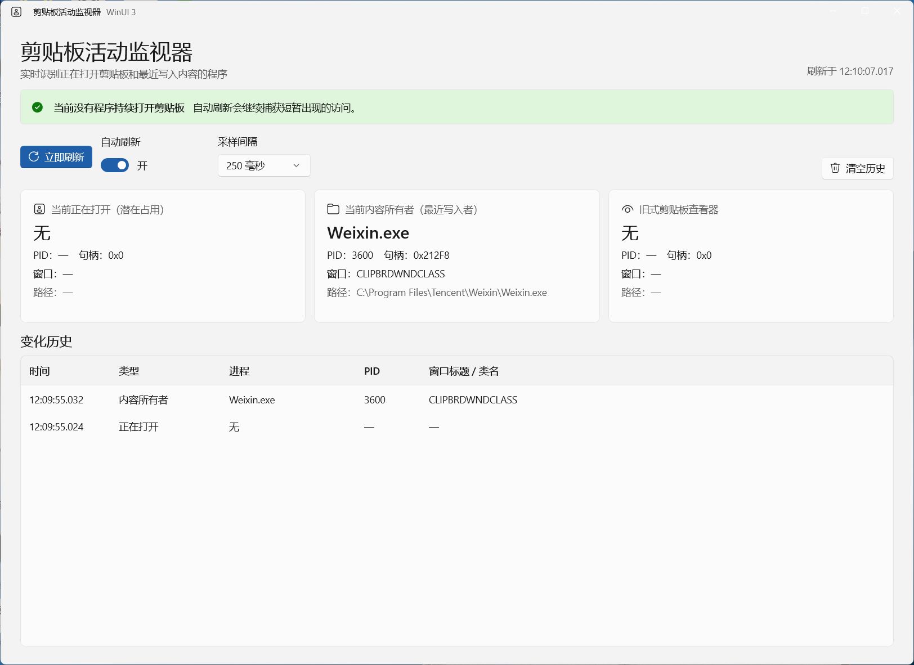

<div align="center">

# Clipboard Activity Monitor

一款使用 WinUI 3 构建的 Windows 剪贴板活动监视器。

[](https://github.com/creamtea47/clipboard-activity-monitor/releases/latest)
[](https://www.microsoft.com/windows/)
[](https://dotnet.microsoft.com/)
[](https://learn.microsoft.com/windows/apps/winui/winui3/)
[](LICENSE)

[下载最新版](https://github.com/creamtea47/clipboard-activity-monitor/releases/latest) · [报告问题](https://github.com/creamtea47/clipboard-activity-monitor/issues/new)

</div>



## 为什么需要它

Windows 中“剪贴板被占用”可能指两种不同状态：某个程序正在打开剪贴板，或者某个程序是剪贴板内容的最近写入者。本工具把它们分开显示，帮助定位复制、粘贴失败以及剪贴板管理器频繁访问等问题。

| 状态 | 含义 |
| --- | --- |
| 当前正在打开 | 此刻调用并打开剪贴板的窗口，可能造成短暂或持续占用 |
| 当前内容所有者 | 最近一次向剪贴板写入内容的窗口，不代表它正在锁定剪贴板 |
| 旧式剪贴板查看器 | 兼容旧版 Windows 查看器链的应用，现代程序通常为空 |

## 功能

- 实时识别进程名、PID、窗口标题、窗口类名和可执行文件路径
- 支持 100、250、500 和 1000 毫秒自动采样
- 仅在状态变化时记录历史，最多保留 500 条
- 使用 Mica、Fluent 控件和系统主题构建原生 Windows 11 界面
- 自动适配 DPI、浅色主题和深色主题
- 长路径自动换行，悬停卡片可查看完整信息
- 不读取、不保存也不上传剪贴板内容

## 下载与运行

1. 打开 [Releases](https://github.com/creamtea47/clipboard-activity-monitor/releases/latest)。
2. 下载 `ClipboardActivityMonitor-v1.0.0-win-x64.zip`。
3. 解压后运行 `ClipboardActivityMonitor.exe`。

运行环境：

- Windows 10 1809 或更高版本，推荐 Windows 11
- x64 处理器
- [.NET Desktop Runtime 10](https://dotnet.microsoft.com/download/dotnet/10.0)
- [Windows App Runtime 2.2](https://learn.microsoft.com/windows/apps/windows-app-sdk/downloads)

## 使用方法

打开程序后保持“自动刷新”开启即可。出现红色记录时，表示捕获到某个程序正在打开剪贴板；如果状态一闪而过，通常是剪贴板管理器或输入法的正常轮询。持续出现同一进程时，再考虑退出或禁用对应程序进行排查。

## 从源码构建

### 环境

- Windows 10 1809 或更高版本
- [.NET 10 SDK](https://dotnet.microsoft.com/download/dotnet/10.0)
- Windows App SDK 2.2

### 命令

```powershell
git clone https://github.com/creamtea47/clipboard-activity-monitor.git
cd clipboard-activity-monitor
dotnet restore
dotnet build -c Release -p:Platform=x64
```

生成结果位于：

```text
bin/x64/Release/net10.0-windows10.0.26100.0/win-x64/
```

## 技术实现

- C# / .NET 10
- WinUI 3 + XAML
- Windows App SDK 2.2
- `GetOpenClipboardWindow`、`GetClipboardOwner` 和 `GetClipboardViewer`
- `GetWindowThreadProcessId` 将窗口句柄映射为进程信息

应用仅查询窗口和进程元数据，不调用读取剪贴板文本、图片或文件内容的 API。

## 隐私

本项目没有遥测、联网请求或云端服务。所有检测均在本机完成，历史记录仅保存在当前程序内存中，关闭程序后自动清除。

## 贡献

欢迎提交 Issue 和 Pull Request。提交代码前请确保：

```powershell
dotnet build -c Release -p:Platform=x64
```

能够以 0 错误、0 警告完成。

## License

本项目采用 [MIT License](LICENSE)。
